# Product Requirements Document (PRD)
## Kyorix Tournament & Event Management Platform (`EvtMgr`)
**Kyorix Sports Technology**  
*Compete. Connect. Elevate.*

---

## 1. Executive Summary & Vision
The **Kyorix Tournament & Event Management Platform** (`EvtMgr`) is an enterprise-grade, Olympic-standard martial arts competition management ecosystem tailored for World Taekwondo (WT) affiliated national/state federations, tournament directors, martial arts academies (dojangs), coaches, and athletes.

The system replaces manual pen-and-paper brackets, unverified weigh-in sheets, offline payment chaos, and disjointed accreditation workflows with a unified, local-first, zero-latency digital operating system. It provides turnkey support for athlete registration, document compliance, entry fee reconciliation, physical accreditation pass printing, automated bracket seeding, electronic ring allocation, referee jury scoring, and verifiable merit certificates.

---

## 2. Target Personas & Core User Journeys

### 2.1. Tournament Director / Federation Administrator (`admin`)
- **Needs**: Complete control over championship parameters, federation sanctions, ring assignments, global entry fee ledgers, bracket publications, and tamper-proof certificate issuance.
- **Primary Journey**: Creates championship event &rarr; sets registration fee & categories &rarr; monitors incoming academy rosters & verifies payments &rarr; generates knockout brackets &rarr; assigns ring courts &rarr; oversees jury scoring &rarr; publishes official merit certificates.

### 2.2. Ring Supervisor / Organizing Committee (`organizer`)
- **Needs**: High-efficiency operational console for weigh-in marshals, court schedules, bout queues, referee assignments, and jury desk oversight.
- **Primary Journey**: Runs official weigh-in desk with scale tolerance checks &rarr; filters scheduled court matches &rarr; updates live round scores (PTG, PTF, RSC, DQ) &rarr; handles walkovers and feeder advancements.

### 2.3. Academy Master / Head Coach (`dojang`)
- **Needs**: Simple team registration, bulk roster management, document uploading for minors, clear UPI/bank payment instructions, official invoice receipts, and printable accreditation badges.
- **Primary Journey**: Logs into Academy Portal &rarr; registers athletes into official or Group-4 divisions &rarr; uploads mandatory government IDs &rarr; pays consolidated entry fees via UPI QR &rarr; downloads tax invoice &rarr; prints verified ID cards.

### 2.4. Competing Athlete (`athlete`)
- **Needs**: Immediate confirmation of registration, document verification status, weigh-in schedule, match bracket position, and digital access to accreditation pass.
- **Primary Journey**: Logs in &rarr; checks document approval badge (`Verified`) &rarr; views digital pass &rarr; views live bout draw & ring allocation &rarr; views verified participation/merit certificate.

### 2.5. Public Spectator / Parents (`guest`)
- **Needs**: Read-only access to tournament information, live bracket progress, court scoreboard showcases, and certificate credential verification.
- **Primary Journey**: Visits portal homepage &rarr; explores event schedule & categories &rarr; views live tournament tree & court results &rarr; scans QR code on certificates to verify authenticity.

---

## 3. Product Architecture & Core Functional Modules

```mermaid
graph TD
    A[Kyorix Tournament Platform] --> B[Roster & Compliance]
    A --> C[Finance & Invoicing]
    A --> D[Accreditation Studio]
    A --> E[Draws & Knockout Engine]
    A --> F[Jury & Court Management]
    A --> G[Electronic Scoring System - ESS]
    A --> H[Certificate Engine]

    B --> B1[Athlete Roster Registration]
    B --> B2[Aadhaar & Birth Cert Lightbox Verification]
    B --> B3[Weigh-In Marshal Scales Roster]

    C --> C1[Dynamic UPI QR Generation]
    C --> C2[Direct Bank Transfer Protocol]
    C --> C3[Academy & Athlete Tax Invoices]

    D --> D1[CR80 Proportional ID Cards]
    D --> D2[Custom Academy Background Template Studio]
    D --> D3[Single & Batch Print Portal]

    E --> E1[WT Single Elimination Knockout Trees]
    E --> E2[Group-4 Grassroots Pools]
    E --> E3[Multi-Round Winner Auto-Advancement]

    F --> F1[Best-of-3 Round Scoring System]
    F --> F2[Court/Ring Filter 01-04 + All Courts]
    F --> F3[Byes Filtered from Ring Schedules]

    G --> G1[Referee Scoring Console]
    G --> G2[Public Arena Court Scoreboard]
    G --> G3[Electronic Sensor Simulation & Gam-jeom]

    H --> H1[Merit & Participation Templates]
    H --> H2[Minimal Scannable Verification QR]
    H --> H3[Client-Side A4 Landscape PDF Rendering]
```

---

## 4. Detailed Feature Specifications

### 4.1. Registration & Category Engine
- **Disciplines**:
  - *Kyorugi* (Olympic Sparring)
  - *Poomsae* (Recognized and Freestyle Forms)
  - *Both* (Combined entry)
- **Age Divisions**:
  - Peewee (Sub-Cadet): Under 10 yrs
  - Cadet (Sub-Junior): 10–12 yrs
  - Junior: 13–17 yrs
  - Senior: 18–35 yrs
  - Masters: 36+ yrs
- **Format Options**:
  - *Official Knockout*: Standard single-elimination tournament tree complying with WT bylaws.
  - *Group-4*: Grassroots development format grouping 4 evenly matched competitors into a mini-pool, guaranteeing 2 bouts per athlete.
- **Weight Class Sanitation**: Automatic cleanup of messy weight labels (e.g. converting `Featherweight (-55 kg)` to clean standardized `Junior Male U-55 kg`).

### 4.2. Document Verification & Compliance
- **Mandatory Requirements**: Every athlete must provide two distinct proof documents:
  1. *Aadhaar Card / Government Photo ID* (Proof of Identity)
  2. *Birth Certificate / Passport / School Bonafide* (Proof of Age)
- **Verification Workflow**:
  - Statuses: `Pending Verification`, `Verified`, `Rejected`.
  - Full-screen doc lightbox supporting image zooms and embedded multi-page PDF documents.
  - Direct approve/reject actions with instant badge reflection on team rosters.

### 4.3. Financial Engine & Payment Verification
- **Payment Modes**:
  - *Direct UPI*: QR generation encoding merchant VPA (`9482797451@kotakbank`), payee name (`DARSHAN A`), and exact amount, with deep-link intent trigger (`upi://pay?...`).
  - *NEFT / IMPS / RTGS*: Display of verified bank account details (Kotak Mahindra Bank, IFSC `KKBK0008094`).
  - *On-Site Cash*: Cash collection during physical weigh-in.
- **Invoicing & Receipts**:
  - Consolidated Academy Tax Invoice with itemized athlete entries, sanction fees, and digital seal.
  - Individual Athlete Fee Receipt for parent reimbursement.

### 4.4. Accreditation Pass & ID Card Studio
- **Standard Dimensions**: 320px wide by 472px high (equivalent to CR80 vertical badge).
- **Badge Content**:
  - Tournament Header with event title.
  - Athlete Photo (66x80px with rounded frame and border).
  - Athlete Full Name, ID Badge (`ATH-849201`), and Academy Name.
  - Scannable Vector QR Code (containing JSON payload of ID, category, DOB, weight, emergency phone, academy).
  - Details Table: Discipline, Format/Division, Weight Division, DOB/Age, Contact Phone.
  - Color-coded Bottom Ribbon: Athlete (Blue), Coach (Amber Gold), Official (Emerald Green).
- **Template Customization Studio**: Organizers can upload custom background graphics; system automatically switches text and tables into high-contrast clean overlays.
- **Zero-Blank-Page Print Engine**: Isolated `#tkd-print-portal` pipeline guaranteeing exactly 1 card per page for single prints, and exact N pages for batch prints with zero trailing blank sheets.

### 4.5. Bracket Generation & Knockout Tree (`draws-app`)
- **Seeding & Bye Rules**: Automated single-elimination bracket creation (sizes: 2, 4, 8, 16, 32, 64).
- **Seed Seeding**: Number 1 seed placed at Top Hong; Number 2 seed placed at Bottom Chong; balanced distribution of remaining competitors and byes.
- **Walkover / Bye Handling**: Byes automatically advance the competitor without generating a contested match. Downstream match feeder displays `W1` (`Winner of Match 1`) until the feeder match concludes.

### 4.6. Official Jury Section & Ring Management
- **Role Restriction**: Strictly accessible only to `admin` and `organizer` roles. Unauthorized visitors receive a 404 security barrier.
- **Match Schedule Filtering**: Byes and walkovers are explicitly excluded from the Jury court match schedule. Only live contested bouts appear on Court 1–4.
- **Best-of-3 Scoring Desk**:
  - Per-round scoring inputs: Round 1, Round 2, Round 3.
  - Victory types: Point Gap (`PTG`), Final Points (`PTF`), Referee Stops Contest (`RSC`), Disqualification (`DQ`), Walkover (`WDR`).
  - Real-time resolution: Scoring Match 1 immediately advances the winner into the next bracket round and unlocks the downstream `Update` button.

### 4.7. Electronic Scoring System (ESS - `ess-app`)
- **Live Match Timers**: Configurable round durations (e.g. 2:00 mins), rest intervals (1:00 min), and timeout stopwatches.
- **Scoring Inputs**: Body trunk kick (2 pts), turning trunk kick (4 pts), head kick (3 pts), turning head kick (5 pts), punch (1 pt).
- **Penalties**: `Gam-jeom` counter giving +1 point to opposing competitor; 5 `Gam-jeom` penalties triggers automatic round forfeiture.
- **Scoreboard Display**: High-contrast arena display mode optimized for ring projectors and spectator televisions.

### 4.8. Federation Certificate Studio & Online Verification
- **Templates**: Merit Certificate (Gold 1st, Silver 2nd, Bronze 3rd) and Official Participation Certificate.
- **Design Safeguards**: Restored WT gold decorative border, dynamic text placement, editable typography modal.
- **Tamper-Proof Verification QR**: Embedded QR code resolves to `#verify-cert?certId=...`, displaying verified competitor data and issuing authority seals.

---

## 5. Non-Functional & Operational Requirements
1. **Local-First & Offline Resilience**: Must function seamlessly on venue LAN without active internet connectivity. All critical state resides in browser `localStorage` with background sync to `server.js`.
2. **Deterministic Print Fidelity**: Printing ID cards, receipts, scale sheets, and certificates must produce exact page counts with zero clipped edges or blank overflow pages across Google Chrome, Microsoft Edge, and Safari.
3. **Responsive Role-Based Layouts**:
   - Staff portals (`admin`, `organizer`) utilize an off-canvas 3-lines drawer navigation across all views (including Tournaments) to maximize desktop work area.
   - Client and guest views (`dojang`, `athlete`, `guest`) utilize a clean top brand navbar.
4. **Sub-100ms Reaction Time**: Score increments and round clock updates in ESS and Jury Desk must execute with zero perceived lag.
5. **Universal Accessibility & Contrast**: Zero-invisible-text safeguards preventing light-on-light or dark-on-dark contrast failures across all user interfaces.

---

## 6. Success Metrics & KPIs
- **Zero Registration Discrepancies**: 100% agreement between academy roster counts, bracket seed counts, and weigh-in scale sheets.
- **Rapid Weigh-In Throughput**: Less than 30 seconds per competitor to verify documents, record weight, and print weigh-in sheet.
- **Exact Accreditation Printing**: Zero misprinted or blank ID passes.
- **Real-Time Tournament Flow**: Under 2 seconds from bout conclusion at the Jury Desk to bracket update and ESS scoreboard refresh.
